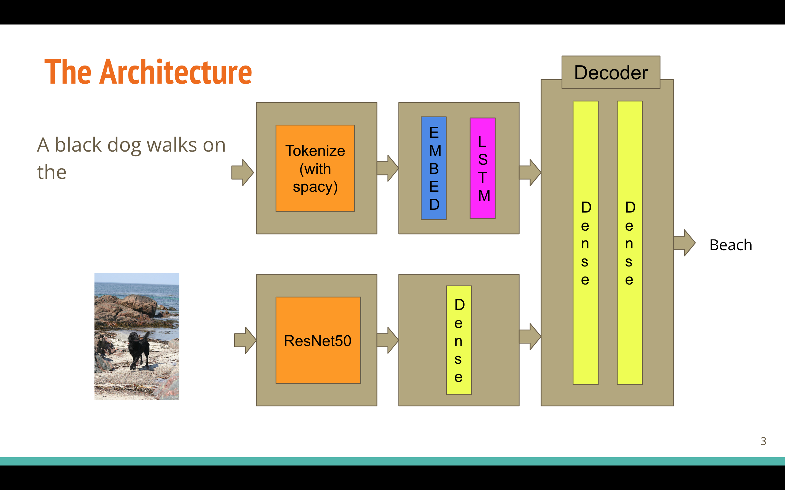

# caption-generation-model

## Description

The goal of this challenge was to create a deep learning model for caption generations. The dataset provided to me, was the [Flicker8k Dataset](https://www.kaggle.com/datasets/adityajn105/flickr8k). The challenge's duration was about two weeks.

One can find the deployed app at [this link](https://fabulous-caption-app.herokuapp.com/)

## Installation

One can run a Docker container with the Dockerfiler. Alternatively, install an environment with the requirements.txt. Then run the app.py file. To run the model_creator notebook one has to additionally run the following code:

`pip install spacy`

`python -m spacy download en_core_web_sm`

## Usage

Run the app.py file. It should then open a browser at [this adress](http://127.0.0.1:4000/). Use the upload button to upload a .jpg file. Then it will print a caption of this model.

## The model
To make this a learning experience a created a model form scratch inspired by this [tutorial](https://machinelearningmastery.com/develop-a-deep-learning-caption-generation-model-in-python/).

The model takes an image and an uncompleted sentence. Then it tries to guess what the next word is. This way we can give the model a secret start sequence. The model will turn back a word which we can add to the start sequence and enter into the model again. We do this until the model returns a secret end sequence or when a limit is reached. The caption is the sequence of words the model gave.

The architecture of the model can be found below.

  
  
 The captions from the dataset are first preprocessed with spacy. They are tokenized and passed on to an rnn layer. The images are preprocessed with ResNet50. The 1000 features obtained from this are passed on to a dense layer. The outputs of the images and captions are then combined in the decoder part of the model. The decoder then outputs the next word of the caption.

## Evaluation

Using the [BLEU](https://en.wikipedia.org/wiki/BLEU) metric, this model scores as  follows:
* BLEU-1: 0.47
* BLEU-2: 0.19
* BLEU-3: 0.10
* BLEU-4: 0.07
